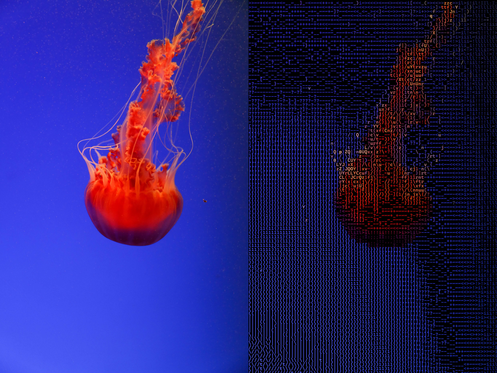

# Go Ascii
## Overview [](https://godoc.org/github.com/fiwippi/go-ascii)
Library which takes an image as input and returns the image made out of coloured ascii characters

## Install
```
go get github.com/fiwippi/go-ascii
```

## Usage
```go
// Get the font file as bytes and reading its data
fb, err := os.ReadFile("font_file.ttf")
if err != nil {
    log.Fatal("Error reading font data: ", err)
}

// Set up the ascii config
ac := NewAsciiConfig()
ac.FontBytes = fb

// Read in an image...

// Generate the ascii image
asciiImg, err := ac.ConvertImage(img)
if err != nil {
    log.Fatal(err)
}
```

## Examples




## License
`BSD-3-Clause`